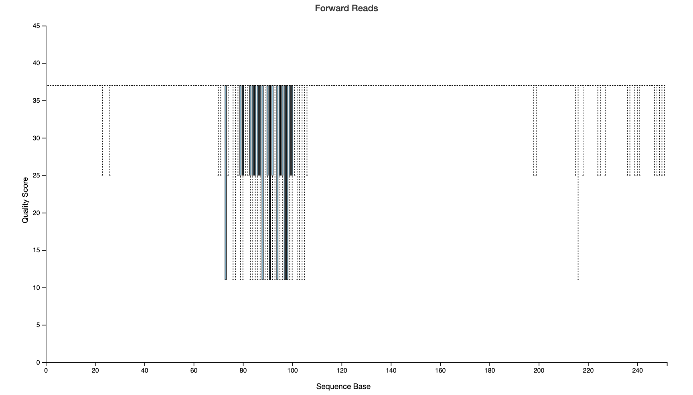
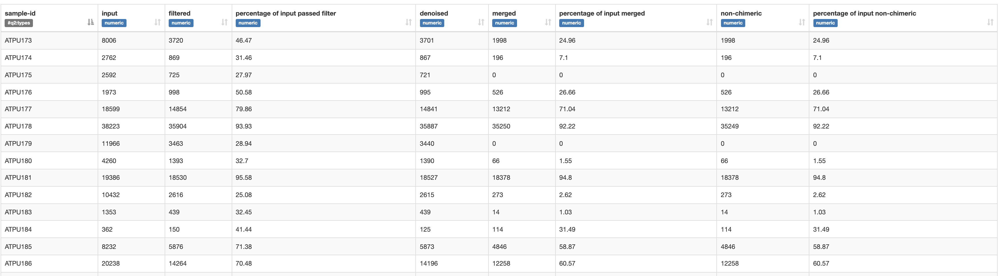
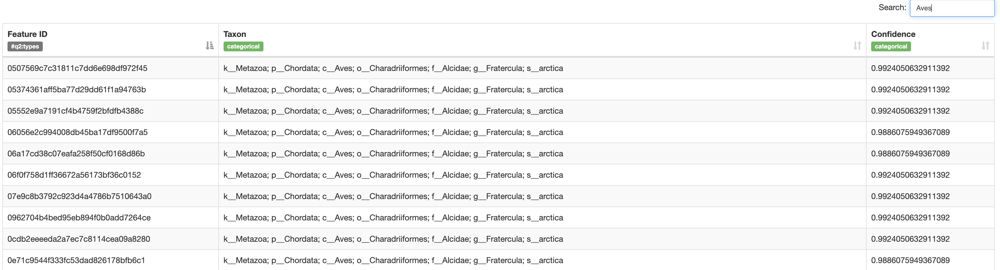
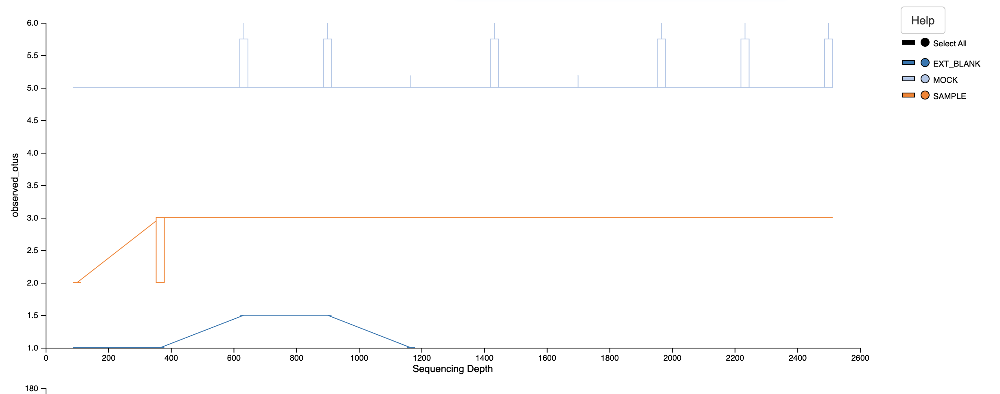
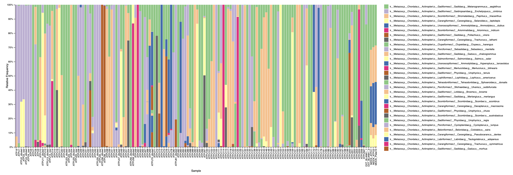

# Matinicus-Rock-Atlantic-Puffins

Started 15th Dec 2021

Fecal metabarcoding analysis for samples collected on Matinicus Rock by Will Kennerley in  2021 and 2022.

The [qiime documentation](https://docs.qiime2.org/2021.11/) is a fantastic resource and before you begin going through this, I would spend some time working through their help guides and tutorials. You can learn a lot from them and might find some better ways of doing things than I've got here, so feel free to modify this workflow as needed.

Below are all the steps for the MiFish analysis for the 2021 samples. The steps for the 2022 samples are essentially the same, but a record of the code I ran is [here](https://github.com/GemmaClucas/Matinicus-Rock-2021-Atlantic-Puffins/blob/main/MiFish_2022_Qiime_commands.md).

The steps for analysing the 18S data in 2021 can be found [here](https://github.com/GemmaClucas/Matinicus-Rock-2021-Atlantic-Puffins/blob/main/18S_ATPU_qiime.md) and for 2022 samples [here](). Again, the code for 2022 is essentially the same as for 2021, but I like to keep a separate record of the exact code I ran.

## 1. Import the data into Qiime2

First, load qiime environment and cd to correct directory in the terminal. Modify this command based on where your working directory will be.
```
cd /Users/gemmaclucas/GitHub/Fecal_metabarcoding/Matinicus-Rock-2021-Atlantic-Puffins
conda activate qiime2-2021.4
```

The raw reads are saved on my solid state hardrive, Data_SS1. There are two whole plates, plates 1 and 2, and then some samples on Fecal_Plate_15. I moved these extra files into their own directory.

Will: You don't acually need the raw reads, since I am sharing the ```demux``` artefacts which are just the raw reads turned into a qiime artefact. So you can skip this step and start at the next one.

Note, there were hidden files in the folders, which I found using ```ls -alh```. I removed them using ```rm ._*```. These were preventing to commands from running initially.

```
qiime tools import\
  --type 'SampleData[PairedEndSequencesWithQuality]'\
  --input-path /Volumes/Data_SS1/MiFish/ATPU_WillK2021_Plate1/211203_A01346_0039_BHTJ7TDRXY_16Mer120321_GC_ATPU1/reads/ \
  --input-format CasavaOneEightSingleLanePerSampleDirFmt\
  --output-path MiFish/demux_plate1.qza
  
qiime tools import\
  --type 'SampleData[PairedEndSequencesWithQuality]'\
  --input-path /Volumes/Data_SS1/MiFish/ATPU_WillK2021_Plate2/211203_A01346_0039_BHTJ7TDRXY_16Mer120321_GC_ATPU2/reads/ \
  --input-format CasavaOneEightSingleLanePerSampleDirFmt\
  --output-path MiFish/demux_plate2.qza
  
qiime tools import\
  --type 'SampleData[PairedEndSequencesWithQuality]'\
  --input-path /Volumes/Data_SS1/MiFish/ATPU_WillK2021_extras/reads/ \
  --input-format CasavaOneEightSingleLanePerSampleDirFmt\
  --output-path MiFish/demux_extras.qza  

```  
Move to the diectory where all the next steps will take place. Summarise read quality and number of reads for each plate. 

Note that the ```for K in {1..2}; do ... done``` notation is just the bash scripting way of writing a for loop to cycle through the two plates.

```
cd MiFish/

for K in {1..2}; do
  qiime demux summarize \
    --i-data demux_Plate$K.qza \
    --o-visualization demux_Plate$K.qzv
done

qiime demux summarize \
    --i-data demux_extras.qza \
    --o-visualization demux_extras.qzv

```

View ```.qzv``` files at [view.qiime2.org](view.qiime2.org). There is a dip in quality around 80-100bp. This could be due to primer dimers. Most samples have tens of thousands to hundreds of thousands of reads, which is more than enough.

 


## 2. Trim primers using cutadapt

The MiFish sequences are:   

F primer: GTCGGTAAAACTCGTGCCAGC (21 bp)   
R primer: CATAGTGGGGTATCTAATCCCAGTTTG (27 bp)   

### Trim 3' ends first
At the 3' end of the read, the primer will have been read through after reading the MiFish region. I need to be looking for the reverse complement of the reverse primer in read 1 (—p-adapter-f) and the reverse complement of the forward primer in R2 (—p-adapter-r).

F primer reverse complement: GCTGGCACGAGTTTTACCGAC   
R primer reverse complement: CAAACTGGGATTAGATACCCCACTATG    

```
for K in {1..2}; do
  qiime cutadapt trim-paired \
    --i-demultiplexed-sequences demux_Plate$K.qza \
    --p-adapter-f CAAACTGGGATTAGATACCCCACTATG \
    --p-adapter-r GCTGGCACGAGTTTTACCGAC \
    --o-trimmed-sequences trimd_Plate$K.qza \
    --verbose > cutadapt_out_Plate$K.txt
done

qiime cutadapt trim-paired \
    --i-demultiplexed-sequences demux_extras.qza \
    --p-adapter-f CAAACTGGGATTAGATACCCCACTATG \
    --p-adapter-r GCTGGCACGAGTTTTACCGAC \
    --o-trimmed-sequences trimd_extras.qza \
    --verbose > cutadapt_out_extras.txt
```

To see how much data passed the filter for each sample:
```
grep "Total written (filtered):" cutadapt_out_Plate1.txt 
grep "Total written (filtered):" cutadapt_out_Plate2.txt
grep "Total written (filtered):" cutadapt_out_extras.txt
```
Very variable amounts of data passed the filters. Not sure why. Maybe lots of primer dimer is getting filtered out here.

Make new visualisations to see how many sequences are left and their quality scores.
```
for K in {1..2}; do
  qiime demux summarize \
    --i-data trimd_Plate$K.qza \
    --o-visualization trimd_Plate$K.qzv
done 

qiime demux summarize \
    --i-data trimd_extras.qza \
    --o-visualization trimd_extras.qzv
```
Looking at the trimd.qzv files, there are still a few thousand sequences for each sample at least.

### Trim 5' ends of reads
All R1 should begin with the forward primer: GTCGGTAAAACTCGTGCCAGC (21 bases).
All R2 should begin with the reverse primer: CATAGTGGGGTATCTAATCCCAGTTTG (27 bases).

Trim these with the following commands:

```
for K in {1..2}; do
  qiime cutadapt trim-paired \
    --i-demultiplexed-sequences trimd_Plate$K.qza \
    --p-front-f GTCGGTAAAACTCGTGCCAGC \
    --p-front-r CATAGTGGGGTATCTAATCCCAGTTTG \
    --o-trimmed-sequences trimd2_Plate$K.qza \
    --verbose > cutadapt_out2_Plate$K.txt
done

qiime cutadapt trim-paired \
  --i-demultiplexed-sequences trimd_extras.qza \
  --p-front-f GTCGGTAAAACTCGTGCCAGC \
  --p-front-r CATAGTGGGGTATCTAATCCCAGTTTG \
  --o-trimmed-sequences trimd2_extras.qza \
  --verbose > cutadapt_out2_extras.txt
```  

Not going to make the qzv files for now.

To see how much data passed the filter for each sample:
```
grep "Total written (filtered):" cutadapt_out2_Plate1.txt 
grep "Total written (filtered):" cutadapt_out2_Plate2.txt
grep "Total written (filtered):" cutadapt_out2_extras.txt
```
About 90% passed the filter here for all samples. That's pretty normal.

## 3. Denoise with dada2
I am going to use the same settings that I found worked best for the 2017-2019 tern fecal samples, except I am adding the --p-min-overlap parameter. If I don't use this, I seem to be getting a load of rubbish reads which are 250bp long and start with long strings of Cs. This option is only available in qiime2-2021.4 and later. I didn't get these rubbish reads before, so I'm not sure what has changed, but the overlap filter seems to fix it. 

Note, this step can be a little slow to run.
```
for K in {1..2}; do
  qiime dada2 denoise-paired \
    --i-demultiplexed-seqs trimd2_Plate$K.qza \
    --p-trunc-len-f 133 \
    --p-trunc-len-r 138 \
    --p-trim-left-f 0 \
    --p-trim-left-r 0 \
    --p-min-overlap 50 \
    --p-n-threads 16 \
    --o-representative-sequences rep-seqs_Plate$K \
    --o-table table_Plate$K \
    --o-denoising-stats denoise_Plate$K
done

qiime dada2 denoise-paired \
  --i-demultiplexed-seqs trimd2_extras.qza \
  --p-trunc-len-f 133 \
  --p-trunc-len-r 138 \
  --p-trim-left-f 0 \
  --p-trim-left-r 0 \
  --p-min-overlap 50 \
  --p-n-threads 16 \
  --o-representative-sequences rep-seqs_extras \
  --o-table table_extras \
  --o-denoising-stats denoise_extras
```

Create visualizations for the denoising stats.
```
for K in {1..2}; do  
  qiime metadata tabulate\
    --m-input-file denoise_Plate$K.qza\
    --o-visualization denoise_Plate$K.qzv
done

qiime metadata tabulate\
  --m-input-file denoise_extras.qza\
  --o-visualization denoise_extras.qzv
```
Very variable numbers of reads get through the denoising/merging/chimera filtering. Not the best stats but hopefully it's fine.
E.g:




To view the rep-seqs (only running this for one plate, will view all after merging plates)
```
qiime feature-table tabulate-seqs \
  --i-data rep-seqs_Plate1.qza \
  --o-visualization rep-seqs_Plate1
```
This looks good. Using 50 as a minimum overlap seems to get rid of junk sequences.


## 4. Merge across plates
I need to merge both the feature tables, which contain the counts of each feature, and the rep-seqs, which contain the actual sequence for each feature. I am using the ```sum``` overlap method so that the data from the samples we sent in as tests are added to the data we got from them when we sequenced them again on the plate.

Note that this requires metadata for each sample, contained in metadata.txt. At the moment this is pretty sparse as I didn't have time to add it all, but if you populate it with breeding stage, breeding period, substrate etc then it's easy to visualise those different groups in the later steps of this analysis, so I would recommend editing the metadata file. You can add any number of new columns to add info about the samples. It just has to be saved as a tab-separated file. 
```
qiime feature-table merge \
  --i-tables table_Plate1.qza \
  --i-tables table_Plate2.qza \
  --i-tables table_extras.qza \
  --i-tables ../../2019_GoM_FecalMetabarcoding/Mifish/Puffin_tests/table_Puffin_tests.qza \
  --p-overlap-method sum \
  --o-merged-table merged-table.qza
  
qiime feature-table summarize \
    --i-table merged-table.qza \
    --m-sample-metadata-file metadata.txt \
    --o-visualization merged-table
    
qiime feature-table merge-seqs \
  --i-data rep-seqs_Plate1.qza \
  --i-data rep-seqs_Plate2.qza \
  --i-data rep-seqs_extras.qza \
  --i-data ../../2019_GoM_FecalMetabarcoding/Mifish/Puffin_tests/rep-seqs_Puffin_tests.qza \
  --o-merged-data merged_rep-seqs.qza
  
qiime feature-table tabulate-seqs \
  --i-data merged_rep-seqs.qza \
  --o-visualization merged_rep-seqs.qzv

```

## 5. Create a database for taxonomy assignment

Will: this step was more involved than I was hoping. If you can follow-along with the commands, great. If not, just use the database I created which is called ```ncbi-refseqs-withHuman```.

The rescript module can download sequences from GenBank (NCBI) given an entrez search term. In this search, I'm searching for anything  with "12S", "12s", "small subunit ribosomal RNA gene", or whole mitochondrial genomes in the title. Then the rest of the terms should capture fish. However, I also want to include seabirds in the database, so that any sequences from the birds get assigned correctly, so I've added some terms for the birds I work with (so that I don't have to recreate this anew every time). 
I'm then filtering to just mitochondrial DNA in case any nuclear sequences get captured. 

```
qiime rescript get-ncbi-data \
--p-query '(12s[Title] OR \
            12S[Title] OR \
            "small subunit ribosomal RNA gene"[Title] OR \
            "mitochondrial DNA, complete genome"[Title] AND \
            ("Chondrichthyes"[Organism] OR \
            "Dipnomorpha"[Organism] OR \
            "Actinopterygii"[Organism] OR \
            "Myxini"[Organism] OR \
            "Hyperoartia"[Organism] OR \
            "Coelacanthimorpha"[Organism] OR \
            fish[All Fields] OR \
            "Sphenisciformes"[Organism] OR \
            "Charadriiformes"[Organism] OR \
            "Procellariiformes[Organism])) \
            AND mitochondrion[filter]' \
  --p-n-jobs 5 \
  --o-sequences ncbi-refseqs-unfiltered.qza \
  --o-taxonomy ncbi-taxonomy-unfiltered.qza  
```

The next step is to clean up the database. They recommend removing sequences with too many degenerate bases or long runs of homoploymers using the cull-seqs option. I am running with default params, which will remove sequences with more than 5 degenerate bases and runs of 8 homopolymers.
```
qiime rescript cull-seqs \
  --i-sequences ncbi-refseqs-unfiltered.qza \
  --p-num-degenerates 5 \
  --p-homopolymer-length 8 \
  --p-n-jobs 4 \
  --o-clean-sequences ncbi-refseqs-culled
```

The final step is to dereplicate the database.
```
qiime rescript dereplicate \
  --i-sequences ncbi-refseqs-culled.qza \
  --i-taxa ncbi-taxonomy-unfiltered.qza \
  --p-mode uniq \
  --p-threads 4 \
  --o-dereplicated-sequences ncbi-refseqs-culled-derep \
  --o-dereplicated-taxa ncbi-taxonomy-culled-derep
```

I think this step also takes care of cleaning up the taxonomy file, so if any sequences were culled in the above step, then they should be removed.

In the summer I was playing around with training a feature classifier on a similar database to assign taxonomy, but it did really badly. Butterfish were consistently assigned to the wrong species, as were haddock. So I will keep using the script below (```mktaxa.py```) to iteratively blast all the rep-seqs against the reference database.


## 6. Assign taxonomy
Note, the blast method only works with an older version of Qiime, so I have to load that first. 
```
conda activate qiime2-2019.4

./mktaxa.py ncbi-refseqs-culled-derep.qza ncbi-taxonomy-culled-derep.qza merged_rep-seqs.qza
```
This creates a file called ```superblast_taxonomy.qza```, which relates the rep-seqs to species. Make a version that can be viewed online:
```
qiime metadata tabulate \
  --m-input-file superblast_taxonomy.qza \
  --o-visualization superblast_taxonomy
```
This file can be used to look up the assignments made to individual features, and to search for species e.g. looking up "Aves" shows that nearly all sequences assigned to Aves were classified as puffins. 



### Add a human sequence to the database manually
I made an error and forgot to add humans to the database. I don't want to add them to my search term, as it will download thousands of human sequences, so I just found one complete mitochondrial genome on GenBank. I put this into a text document ```temp.txt``` and deleted the carriage returns at the end of each line using ```tr -d '\n' < temp.txt > output.txt ```. 

I exported the sequences and taxonomy artefacts from qiime into simple text docs:
```
qiime tools export \
  --input-path ncbi-taxonomy-culled-derep.qza \
  --output-path editing_database
  
qiime tools export \
  --input-path ncbi-refseqs-culled-derep.qza \
  --output-path editing_database
  
```
I added the sequence and corresponding taxonomy string to each file by hand. Then I imported them back into Qiime:
```
qiime tools import \
  --input-path editing_database/taxonomy.tsv \
  --output-path editing_database/ncbi-taxonomy-withHuman \ 
  --type 'FeatureData[Taxonomy]'
  
qiime tools import \
  --input-path editing_database/dna-sequences.fasta \
  --output-path editing_database/ncbi-refseqs-withHuman \
  --type 'FeatureData[Sequence]'  
```

### Re-assign taxonomy using edited database
Note, I am just overwriting the old file here since I don't want to have two versions hanging around.
```
conda activate qiime2-2019.4

./mktaxa.py editing_database/ncbi-refseqs-withHuman.qza editing_database/ncbi-taxonomy-withHuman.qza merged_rep-seqs.qza
```
Remake the version that can be viewed online:
```
qiime metadata tabulate \
  --m-input-file superblast_taxonomy.qza \
  --o-visualization superblast_taxonomy
```
Searching this shows five features that were classified as human, although three of them have <95% identity, so are likely some other mammalian sequence or something.

To find out exactly what they are, copy the feature ID and search for it in the ```merged_rep-seqs.qzv``` file (CTR +F). If you click on the sequence, it will automatically set-up a blast search for them in genbank. Click "View Report" to run the search (it will take a minute).

I looked at one of them and it showed it was a nuclear copy of the mitochondrial gene. Mitochondrial genes sometimes have copies in the nuclear genome that get mutated over time, so that explains why it's not a great match to the mitochondrial sequence we have in the database.

## 7. Remove non-food reads
Filter out any sequences from the bird, mammals (human), and unnassigned sequences since we're not interested in these.

```
qiime taxa filter-table \
  --i-table merged-table.qza \
  --i-taxonomy superblast_taxonomy.qza \
  --p-exclude Unassigned,Aves,Mammalia \
  --o-filtered-table merged_table_noBirdsMammalsUnassigned.qza
  
qiime feature-table summarize \
    --i-table merged_table_noBirdsMammalsUnassigned.qza \
    --m-sample-metadata-file metadata.txt \
    --o-visualization merged_table_noBirdsMammalsUnassigned
```

## 8. Make some barplots
First, I do actually want to see how many puffin, human, and unassigned sequences there were.
```
qiime taxa barplot \
  --i-table merged-table.qza \
  --i-taxonomy superblast_taxonomy.qza \
  --m-metadata-file metadata.txt \
  --o-visualization barplot_before_filtering.qzv
```
19 samples had 100% avian DNA, which is annoying since we can't recover any fish DNA from them. I haven't seen this in terns before. Perhaps the primers are a better match to puffins? Or perhaps the birds hadn't fed on anything recently? Not sure.

Barplot having removed bird/human/unassigned DNA:
```
qiime taxa barplot \
  --i-table merged_table_noBirdsMammalsUnassigned.qza \
  --i-taxonomy superblast_taxonomy.qza \
  --m-metadata-file metadata.txt \
  --o-visualization barplot_noBirdsMammalsUnassigned.qzv
```

## 9. Calculate alpha rarefaction curves 

To find out what depth of sequencing we need to recover all of the diversity in our samples, we can create rarefaction curves. But first, you have to collapse the taxonomy, so that you are rarefying based on species assignments and not ASVs (which we are not interested in, but microbial people are). I am going to rarefy from a depth of 100 to 20,000 reads to begin with.
```
qiime taxa collapse \
  --i-table merged_table_noBirdsMammalsUnassigned.qza \
  --i-taxonomy superblast_taxonomy.qza \
  --p-level 7 \
  --o-collapsed-table merged_table_noBirdsMammalsUnassigned_collapsed.qza

qiime diversity alpha-rarefaction \
  --i-table merged_table_noBirdsMammalsUnassigned_collapsed.qza \
  --m-metadata-file metadata.txt \
  --p-min-depth 100 \
  --p-max-depth 20000 \
  --o-visualization alpha-rarefaction-100-20000
```
When viewing the qzv file, select the sample metadata column "SampleType" to separate the samples out from the blanks and mock community. The Shannon diversity is flat for the samples (ignore the mock community, this is artifically diverse compared to the samples). The curve for the observed OTUs (species) increases from 100 to 2000, but we don't know whether it might flatten before 2000, so repeat the rarefaction for this range to find out what the actual minimum depth is without sacrificing the diversity of the samples.
```
qiime diversity alpha-rarefaction \
  --i-table merged_table_noBirdsMammalsUnassigned_collapsed.qza \
  --m-metadata-file metadata.txt \
  --p-min-depth 100 \
  --p-max-depth 2500 \
  --o-visualization alpha-rarefaction-100-2500
```
Shannon diversity is still flat for the samples. The observed OTUs has quite a lot of variability at 400 but has plateued by 600. This suggests that 600 is the minimum depth of sequencing we should use.



## 10. Rarefy to a deph of 600 and redo barplots

Rarefying all samples to a depth of 600 will account for the fact that some samples were seuquenced deeply and some much less so. Any samples with fewer than 600 reads will be droppped. 

Note, this is done on the un-collapsed table.
```
qiime feature-table rarefy \
  --i-table merged_table_noBirdsMammalsUnassigned.qza \
  --p-sampling-depth 600 \
  --o-rarefied-table merged_table_noBirdsMammalsUnassigned_rarefied600
  
qiime taxa barplot \
  --i-table merged_table_noBirdsMammalsUnassigned_rarefied600.qza \
  --i-taxonomy superblast_taxonomy.qza \
  --m-metadata-file metadata.txt \
  --o-visualization barplot_oBirdsMammalsUnassigned_rarefied600.qzv
```
This is what the barplots look like after rarefying:


And I have downloaded and saved this rarefied feature table to ```featuretable_rarefied600.csv```. This is the dataset to use going forward or your own version if you are doing this all yourself. Note that mine and yours will differ slightly, as the rarefaction will not pick the exact same sequences everytime it is repeated.

### 11. Next steps

This is all that I had time for, so, I'm afraid, the rest is up to you for now.

The next thing I would usually do is go through all the species in ```featuretable_rarefied600.csv``` and check that I trust these assignments. So for each species I would:

1. Make sure that the species is found in the north Atlantic by looking it up in [FishBase](https://www.fishbase.de/). Some species get assigned to their Pacific counterparts, but the next couple of steps will help you sort this out.

2. Find the species in the ```superblast_taxonomy.qzv``` file and make sure that the percent identity (confidence) is above 98%. A 98% or greater match seems to be pretty good for identifying fish to species level. If it is less than this, use the next step to help you decide whether it can be assigned to genus or just family level.

3. Copy the featureIDs down and look them up in the ```merged_rep-seq.qzv``` file. I then blast the sequences against Genbank, to make sure that there isn't another species which also has a 98% or higher match **that is also found in the Atlantic**. This last point is key, because often there are Pacific species which are good matches, but you can rule them out easily based on the species distribution (fishbase is your friend). If there is another Atlantic species with a 98% match or greater, then just use the genus, E.g. *Ammodytes* usually gets a 98% match to *A. personnatus*, *A. dubius*, and *A. americanus*. We can rule out *personnatus* based on geography, but we cannot reliably differentiate *dubius* and *americanus*, so we just have to call them *Ammodytes sp.* If one fecal sample has multiple *Ammodytes* assignments, sum up the sequence counts. Same goes for river herrings, which also cannot be distinguished. 

4. Repeat for all species in the table and edit the species assignments as needed. Sometimes there won't be a perfect match on GenBank, so use yoour judgement as to whether you can make a genus- or family-level call.

5. What you do next is up to you, but I can also help when I get back. You can calculate alpha and beta diversity metrics in qiime and explore the other plugins. Or just start working with the data in R.

Good luck!
